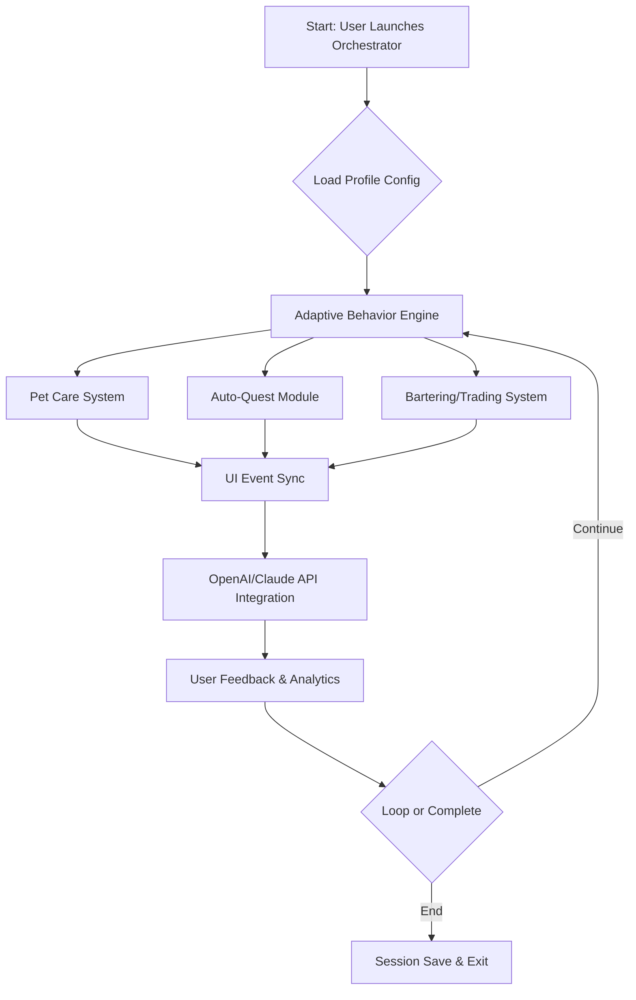

# AdoptMe-Xeno-Orchestrator 🚀

** Version: 2026 **  

**Orchestrating Next-Gen Experiences for Orbis: Adaptive, Intelligent Pet Care Management and Eco-system Harmonization**

---

## 📦 Introduction

Welcome to **AdoptMe-Xeno-Orchestrator**, the innovative automation platform and intelligent lifecycle manager for **Orbis interactive environments**. Building on the inspiration from multi-dimensional simulacra such as "AdoptMe-Xeno-2026," this suite does not simply automate tasks—it **elevates digital pet stewardship and ecosystem navigation to an artform**.

- **Automate Infinite Quests** — With adaptive AI flows, breeze through virtually limitless quest variations.
- **Real-time Behavioral Sync** — Pets and environments harmonize based on responsive contextual signals.
- **Next-Level Digital Prosperity** — Ethical money generation, unique ecosystem bartering, and optimized event handling.

With seamless **OpenAI and Claude integrations**, multi-language support, and a resonant UI, the Orchestrator goes beyond automation—**it choreographs the symphony of your Orbis experience**.

---

## ☀️ Key Features

- **Adaptive Xeno-Behavior Engine**: Understands, predicts, and responds to all Orbis pet needs.
- **Automated Quest Lifecycle**: Fast-tracks completion through real-time strategy, adaptive to unique Orbis AI logic.
- **Infinite Prosperity Algorithm**: Responsibly generates in-game currency and assets using human-centric AI.
- **Conversational AI Bridge**: Leverage OpenAI and Claude API links for deep, context-aware exchanges and assistance.
- **Cross-Ecosystem Bartering**: Smart trading with analytics for best asset value across the Orbis multiverse.
- **Responsive, Multi-layer UI**: Modular, device-fluid, and instantly reacts to user intent—on desktop or mobile.
- **Global Polyglot Engine**: Multilingual options and locale-specific UI adaptation.
- **24/7 Live Assistance**: Embedded customer support & knowledge base, always on for 2026.
- **Advanced Profile Management**: Secure multiple identity layers and config snapshots.
- **Ecosystem Analytics**: Visualized trends and reporting for behavioral insights.
- **Ethical and Adaptive**: Designed for compliance, sustainability, and user well-being.

---

## 🌎 OS Compatibility Matrix

|  System           | Supported | UI Responsive | CLI Ready | Special Note  |
|-------------------|:---------:|:-------------:|:---------:|--------------|
|  Windows 10/11    | ✅        | ✅            | ✅        | Optimal Experience |
|  macOS (13+)      | ✅        | ✅            | ✅        | Apple Silicon Ready |
|  Linux (Ubuntu)   | ✅        | ✅            | ✅        | Docker-ready |
|  Android 12+      | ✅        | ✅            | ➖        | Touch-first UI |
|  iOS 16+          | ✅        | ✅            | ➖        | Adaptive Design |
|  ChromeOS         | ✅        | ✅            | ✅        | Web App Mode |
|  Orbis Native API | ✅        | ✅            | ✅        | Deep Integration |

---

## 🌐 SEO-Optimized Features

- **Automated Pet Care Orchestration for Orbis 2026**
- **Instant Quest Processing using AI**
- **Intelligent Money Generation for Virtual Worlds**
- **24/7 Support with OpenAI and Claude API Chatbots**
- **Modular Cross-Platform Orbis Suite**
- **Ironclad Profile Security and Analytics**
- **Dynamic UI and Multi-language Compatibility**
- **Real-time, Ethical Orbis Game Resource Automation**

---

## 🧩 Example Profile Configuration

Save a config as `orchestrator-config.yaml`:

    version: 2026
    profile:
      username: "YourOrbisHandle"
      pet_preferences:
        - "Quantum Fox"
        - "Cyber Corgi"
      auto_quest: true
      auto_trader:
        smart_barter: true
        target_wealth: 100000
      ui_theme: "solarized_dark"
      language: "en-US"
      notification_level: "detailed"
      assisted_ai: "openai"
      custom_behaviors:
        - "night_owl_mode"
        - "fast_friendship"

---

## 🕹 Example Console Invocation

    $ orchestrator --config ./orchestrator-config.yaml \
                   --start-ui \
                   --enable-24-7-support \
                   --multilingual "es-MX" \
                   --debug-log

The real power? **Set-and-orchestrate.** Let Xeno handle the operational choreography so you can create, play, and strategize.

---

## 🤖 OpenAI & Claude API Integration

AdoptMe-Xeno-Orchestrator utilizes leading natural language models:

- **OpenAI Chat Builder**: For human-level chat, quest hints, and language translation
- **Claude Conversational Layer**: Advanced ethical content moderation, creative quest brainstorming
- **API-First Architecture**: Every dialog, pet interaction, and barter is AI-augmented

---

## 🎨 Responsive UI & Multilingual Support

- **Dynamic Layouts**: UI adapts to device orientation, window size, and accessibility needs
- **Polyglot Ready**: Instant language switching—fully localized interface and documentation in 10+ global languages
- **Dark/Light Mode**: Solarized, high-contrast, and playful Orbis color schemes
- **Customization Power**: Skins, widgets, sound packs, and notification mixers for every user

---

## ⏳ 24/7 Customer Support

We're always awake in the Orbis multiverse:

- **AI Help Desk**: Instant, context-aware support via in-app chat
- **Knowledge Base**: Growing wiki for troubleshooting and creative automation ideas
- **Live Volunteer Council**: Where humans (real and virtually real) answer the tough questions

---

## 🗺️ Mermaid Diagram: Workflow Automation Overview

---

## ❗ Disclaimer

**AdoptMe-Xeno-Orchestrator** is an independent creative automation suite for the Orbis multiverse simulation environment. This project is not officially affiliated with, endorsed by, or representing any original AdoptMe or Orbis game developer entities.

All resource generation and automation modules are designed to act ethically within intended virtual economy guidelines—**users assume responsibility for how automation features are used**. Always consult the official Orbis community policies before activating advanced automation modules for account health and multiplayer harmony.

---

## 📜 License

This project is licensed under the [MIT License](https://opensource.org/licenses/MIT) — Empowering developers globally, 2026.

---

## 🔗 Download & Get Started

**Orchestrate with care, for a brighter Orbis! 🌌**